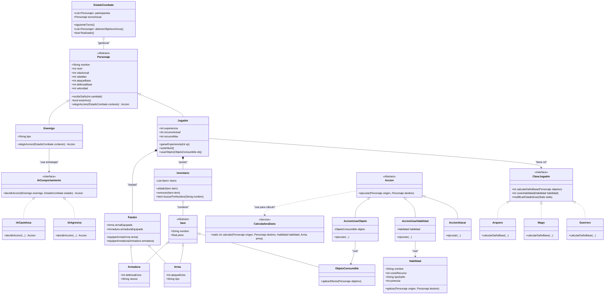

# Diseño de Clases - Juego de Rol por Turnos

## Diagrama de Clases UML (Mermaid)

## Descripción del Diseño

### Justificación de Patrones
1.  **Estrategia (Strategy Pattern)**: Se utiliza en `IAComportamiento` (y sus implementaciones `IAAgresiva`, `IACautelosa`) y en `ClaseJugador` (`Guerrero`, `Mago`, `Arquero`). Esto permite cambiar el comportamiento del Enemigo o las reglas de estadísticas del Jugador sin modificar la clase base `Personaje`, favoreciendo el principio *Open/Closed*.
2.  **Servicio (Service)**: `CalculadoraDaño` se extrae como una clase utilitaria o servicio estático. Esto evita que la lógica de cálculo de daño (que puede volverse compleja con armas, armaduras, bonos, tipos de daño) infle la clase `Personaje`. Centraliza las reglas matemáticas del combate.
3.  **Command (Simplificado)**: La clase `Accion` encapsula una operación (Atacar, UsarHabilidad). Esto permite que el `EstadoCombate` solicite una acción abstracta sin saber los detalles, y facilita la extensibilidad (p. ej., añadir `AccionDefender` en el futuro).

### Decisiones de Encapsulación
*   **Gestión de Estado**: `vidaActual` y `recursoActual` no deberían ser públicos para escritura directa. Se modifican a través de métodos controlados como `recibirDaño()` o `usarHabilidad()`, los cuales pueden validar reglas (no bajar de 0, disparar eventos de muerte).
*   **Inventario y Equipo**: Están separados del `Jugador` mediante composición. El `Jugador` no maneja listas de items directamente, sino que delega en la clase `Inventario`.
*   **Lógica de Turnos**: `EstadoCombate` encapsula la lista de participantes y el índice de turno, impidiendo que actores externos manipulen el orden arbitrariamente.

### Flujo de Caso de Uso: "Turno completo"

1.  **Inicio de Turno**:
    *   `EstadoCombate` determina que es el turno del `Jugador` (basado en velocidad).
    *   `EstadoCombate` notifica al `Jugador` o solicita su acción.

2.  **Selección de Acción**:
    *   El usuario (interfaz hipotética) selecciona usar la habilidad "Bola de Fuego" (Habilidad).
    *   El sistema verifica si `Jugador.recursoActual >= Habilidad.costoRecurso`.
    *   Si es válido, se instancia una `AccionUsarHabilidad` con la habilidad y el objetivo seleccionado (`Enemigo`).

3.  **Ejecución**:
    *   `AccionUsarHabilidad.ejecutar(Jugador, Enemigo)` es llamada.
    *   La acción consume el recurso del jugador.
    *   La acción invoca a `CalculadoraDaño.calcular(Jugador, Enemigo, Habilidad, Arma)`.

4.  **Cálculo y Aplicación**:
    *   `CalculadoraDaño` computa: `(AtkBase + Arma + Potencia) - (DefBase + Armadura)`. Resultado: 25 daño.
    *   La acción llama a `Enemigo.recibirDaño(25)`.
    *   `Enemigo` reduce su vida. Si vida <= 0, su estado cambia a muerto.

5.  **Fin de Turno**:
    *   El método `ejecutar` finaliza.
    *   `EstadoCombate` avanza el índice de turno con `siguienteTurno()` y verifica si el combate ha `finalizado()`.
